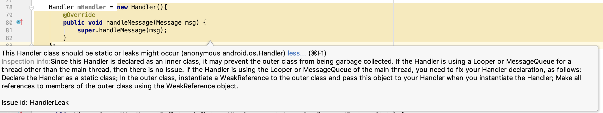
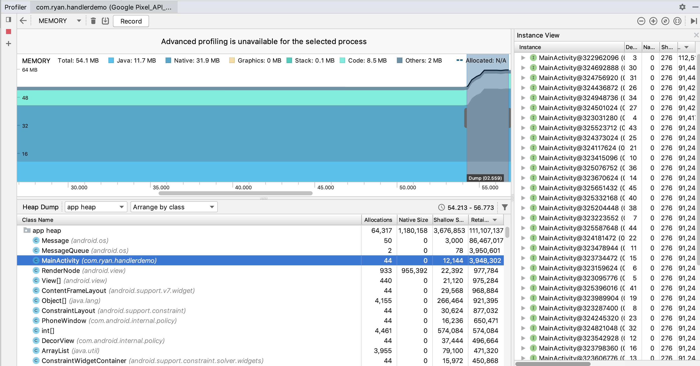
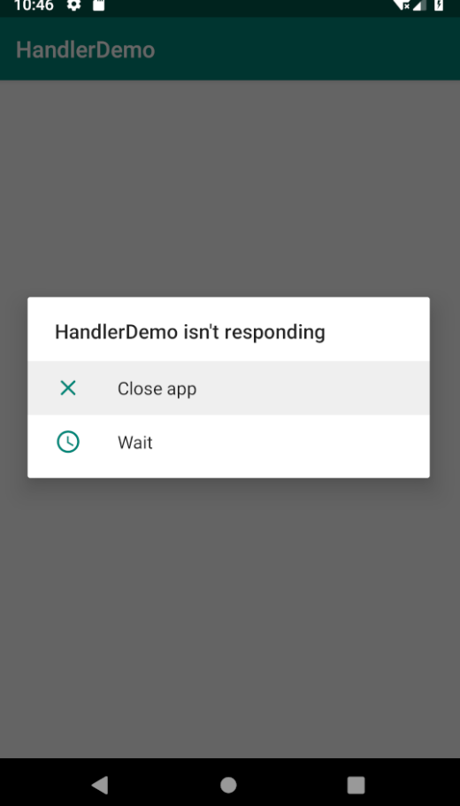

* content
{:toc}


>使用下面的方式定义一个Handler，AndroidStudio会弹出提醒，表示可能存在内存泄漏的风险。




Lint的提示信息翻译如下：

> Handler被声明为内部类，可能会阻止外部类被回收。如果Handler不是使用主线程中的Looper或者MessageQueue，那么就没有此问题。但是如果Handler使用的是主线程的Looper或者MessageQueue，那么需要将其作为一个静态类，并在Handler初始化的时候将外部类实例对象以弱引用的方式传递给Handler

在理解上面这段话之前，我们先来看下外部类和内部类的一些信息。

#### 外部类和内部类

 ⁨定义一个Outer.java

```java
public class Outer {
    public class Inner {
    }
}
```

使用javac Outer.java之后，发现会编译生成两个字解码文件Outer$Inner.class和Outer.class，其中Outer$Inner.class就是内部类Inner编译出来的。

通过javap -verbose Outer\$Inner.class查看得到如下的代码

```java
Classfile /Users/ryan/WORK_SPACE/内部类外部类/Outer$Inner.class
  Last modified 2019-8-27; size 295 bytes
  MD5 checksum a1ce7b373c395bf2cda9a885450cf033
  Compiled from "Outer.java"
public class Outer$Inner
   ... ...
{
  final Outer this$0;
   ... ...
}

```

可以看到Outer\$Inner.class存在一个成员变量this$0，这个就是外部类的实例，所以非静态内部类实际上会持有外部类对象的引用。

了解这点对于需要开发JNI开发中回调Java内部类的方法、函数的时候，会有很大的帮助。


#### Handler内存泄漏场景解析

AndroidStudio 3.4版本在build之后，会将编译生成的class文件放在下面路径中

<工程根目录>/app/build/intermediates/javac/debug/compileDebugJavaWithJavac/classes/<包名>

```java
public class MainActivity extends AppCompatActivity {
    ... ...
    Handler mHandler = new Handler(){
        @Override
        public void handleMessage(Message msg) {
            super.handleMessage(msg);
        }
    };
}
```

上面这段代码会编译生成下面这么多的class文件

```
RyandeMacBook-Pro:handlerdemo Ryan$ ls -al
total 312
drwxr-xr-x  20 Ryan  staff    640  9 27 21:31 .
drwxr-xr-x   4 Ryan  staff    128  9 27 21:33 ..
-rw-r--r--   1 Ryan  staff    717  9 27 21:31 BuildConfig.class
-rw-r--r--   1 Ryan  staff    656  9 27 21:31 MainActivity$1.class
-rw-r--r--   1 Ryan  staff    685  9 27 21:31 MainActivity$2.class
-rw-r--r--   1 Ryan  staff   1493  9 27 21:31 MainActivity.class
-rw-r--r--   1 Ryan  staff    870  9 27 21:31 R$anim.class
-rw-r--r--   1 Ryan  staff  14534  9 27 21:31 R$attr.class
-rw-r--r--   1 Ryan  staff    523  9 27 21:31 R$bool.class
-rw-r--r--   1 Ryan  staff   4877  9 27 21:31 R$color.class
-rw-r--r--   1 Ryan  staff   6811  9 27 21:31 R$dimen.class
-rw-r--r--   1 Ryan  staff   5688  9 27 21:31 R$drawable.class
-rw-r--r--   1 Ryan  staff   5512  9 27 21:31 R$id.class
-rw-r--r--   1 Ryan  staff    633  9 27 21:31 R$integer.class
-rw-r--r--   1 Ryan  staff   2364  9 27 21:31 R$layout.class
-rw-r--r--   1 Ryan  staff    448  9 27 21:31 R$mipmap.class
-rw-r--r--   1 Ryan  staff   2621  9 27 21:31 R$string.class
-rw-r--r--   1 Ryan  staff  21753  9 27 21:31 R$style.class
-rw-r--r--   1 Ryan  staff  39081  9 27 21:31 R$styleable.class
-rw-r--r--   1 Ryan  staff    955  9 27 21:31 R.class
```

通过javap命令查看发现

public class com.ryan.handlerdemo.**MainActivity** extends android.support.v7.app.AppCompatActivity

class com.ryan.handlerdemo.**MainActivity$1** implements java.lang.Runnable

class com.ryan.handlerdemo.**MainActivity$2** extends android.os.Handler

MainActivity.class对应MainActivity的类，MainActivity$1.class对应Runnable匿名内部类，

MainActivity$2对应Handler匿名内部类。

所以我们要查看的其实就是MainActivty$2.class这个文件。

```java
Classfile HandlerDemo/app/build/intermediates/javac/debug/compileDebugJavaWithJavac/classes/com/ryan/handlerdemo/MainActivity$2.class
  Last modified 2019-9-27; size 685 bytes
  MD5 checksum 56f2b67442e90260ce6dfc9f8c9a5806
  Compiled from "MainActivity.java"
class com.ryan.handlerdemo.MainActivity$2 extends android.os.Handler
  ... ...
{
   final com.ryan.handlerdemo.MainActivity this$0;
   ... ...
}
```

可以看到MainActivity$2作为Handler匿名内部类会持有外部类

   final com.ryan.handlerdemo.MainActivity this$0;

如果在Handler发送如下的延迟消息，这个Handler将一直持有外部类的引用，直到30分钟之后才能够释放，导致外部的MainActivity对象无法被销毁。如果在短时间内频繁启动关闭此应用，很容易出现内存泄露的情况。

```java
        mHandler.postDelayed(new Runnable() {
            @Override
            public void run() {
              // do some thing
            }
        }, 1000 * 60 * 30);
```

如下图所示，在重复打开应用、然后按Back键退出几十次以后，内存中MainActivty的对象存在了44个




Profiler运行之后切换到Memory页面，工具会检测应用关于下面指标的数值

| Profiler中标识 | 官方说明                                                     | 备注         |
| -------------- | ------------------------------------------------------------ | ------------ |
| **Java**       | 从 Java 或 Kotlin 代码分配的对象的内存                       | Java堆内存   |
| **Native**     | 从 C 或 C++ 代码分配的对象的内存                             | Native堆内存 |
| **Graphics**   | 图形缓冲区队列向屏幕显示像素（包括 GL 表面、GL 纹理等等）所使用的内存 |              |
| **Stack**      | 您的应用中的原生堆栈和 Java 堆栈使用的内存。这通常与您的应用运行多少线程有关 | 栈内存       |
| **Code**       | 您的应用用于处理代码和资源（如 dex 字节码、经过优化或编译的 dex 代码、.so 库和字体）的内存。 |              |
| **Others**     | 您的应用使用的系统不确定如何分类的内存                       |              |
| **Allocated**  | 您的应用分配的 Java/Kotlin 对象数。此数字没有计入 C 或 C++ 中分配的对象。：从 Java 或 Kotlin 代码分配的对象的内存。 |              |

通过一个简单的脚本执行，明显可以看到Profiler中Java堆内存和Native堆内存在不断增长

```shell
#! /bin/bash
while true
do 
  adb shell am start-activity com.ryan.handlerdemo/.MainActivity ;   
  adb shell input keyevent KEYCODE_BACK;
 done
```

他们当然不会无线增长，当Java堆，Native堆，栈等超出预定的阀值的时候，内存泄露就出现了。在执行上面的脚本过程中，就出现了如下的Java堆和栈溢出的情况，如果MainActivity中有Native层的调用，文件的输入输出，也很容易出现Native堆的溢出，FD的溢出。



##### Java堆溢出

adb shell getprop | grep dalvik

查看每个进程最大的堆栈可以是多少，

[dalvik.vm.heapsize]: 384m

如下就是超过了384M堆栈内存以后爆出的异常信息

```HTML
D/AndroidRuntime(15204): Shutting down VM
E/AndroidRuntime(15204): FATAL EXCEPTION: main
E/AndroidRuntime(15204): Process: com.ryan.handlerdemo, PID: 15204
E/AndroidRuntime(15204): java.lang.OutOfMemoryError: Failed to allocate a 335544336 byte allocation with 6291456 free bytes and 142MB until OOM, max allowed footprint 259283456, growth limit 402653184
E/AndroidRuntime(15204): 	at java.util.Arrays.copyOf(Arrays.java:3260)
E/AndroidRuntime(15204): 	at java.lang.AbstractStringBuilder.ensureCapacityInternal(AbstractStringBuilder.java:125)
E/AndroidRuntime(15204): 	at java.lang.AbstractStringBuilder.append(AbstractStringBuilder.java:451)
E/AndroidRuntime(15204): 	at java.lang.StringBuilder.append(StringBuilder.java:137)

```


##### 栈溢出

过了一段时间有出现了如下的栈溢出，其实我仅仅是在代码里面声明了testStack()的递归方法，但是并没有任何地方去触发调用。

```java
private void testStack() {
    testStack();
}
```

当堆栈容量大于8MB的时候，就会爆出下面栈泄漏异常

E/AndroidRuntime(17016): FATAL EXCEPTION: main

E/AndroidRuntime(17016): Process: com.ryan.handlerdemo, PID: 17016

E/AndroidRuntime(17016): java.lang.StackOverflowError: stack size 8MB

E/AndroidRuntime(17016): 	at com.ryan.handlerdemo.MainActivity.testStack(MainActivity.java:31)

E/AndroidRuntime(17016): 	at com.ryan.handlerdemo.MainActivity.testStack(MainActivity.java:31)

E/AndroidRuntime(17016): 	at com.ryan.handlerdemo.MainActivity.testStack(MainActivity.java:31)

通过ulimit -a查看应用的栈大小如下

```
core file size          (blocks, -c) 0
data seg size           (kbytes, -d) unlimited
file size               (blocks, -f) unlimited
max locked memory       (kbytes, -l) unlimited
max memory size         (kbytes, -m) unlimited
open files                      (-n) 256
pipe size            (512 bytes, -p) 1
stack size              (kbytes, -s) 8192
cpu time               (seconds, -t) unlimited
max user processes              (-u) 1418
virtual memory          (kbytes, -v) unlimited
```

所以应用能够使用的stack size大小为8192KB，即8MB。


#### 常见的解决方案

所以这样的Handler引起的内存泄漏不能小视，可能会在极端情况下引起各种异常。

通过Handler构建内部静态类的方式，使得内部类不再持有外部类的引用。在Handler对象创建的时候传入外部类的实例对象，并通过这个实例对象操作外部类对象的所有方法。

```java
private static class MyHandler extends Handler {
    private final WeakReference<StorageDemoFragment> mFragment;

    public MyHandler(StorageDemoFragment fragment){
        mFragment = new WeakReference<StorageDemoFragment>(fragment);
    }

    @Override
    public void handleMessage(Message msg) {
        super.handleMessage(msg);
    }
}

//创建Handler时候把外部实例传递进去
Handler myHandler = new MyHandler(this);
```

