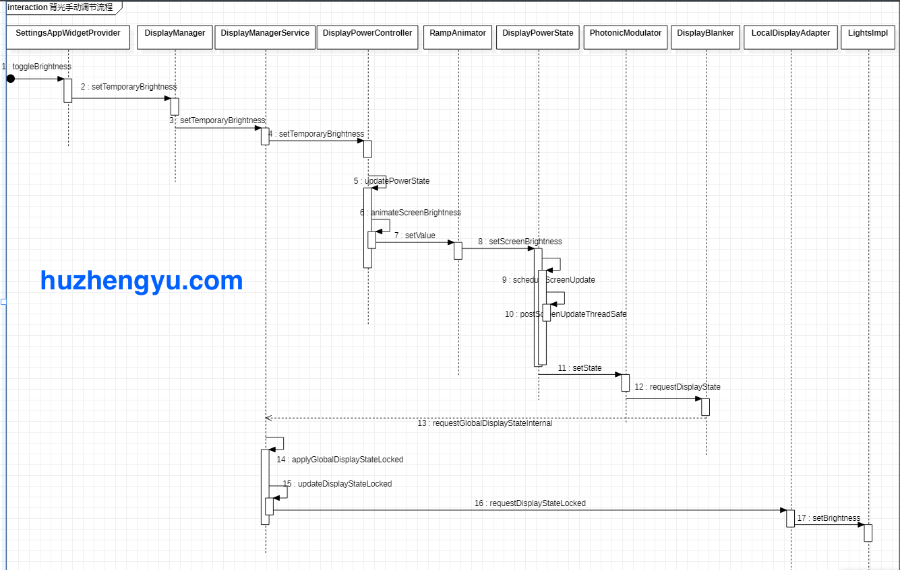

* content
{:toc}


>Lights是Android里面一个相对比较简单但是重要的子系统，通过Lights的服务，手机才得以控制亮屏、灭屏，呼吸灯，按键灯等跟LED相关的功能。本文将对几种常用的灯做简单的介绍。

#### Android中Light的类型
Android设备中的原生的LED灯的类型可以查看下面的文件
```java
frameworks/base/services/core/java/com/android/server/lights/LightsManager.java
22      public static final int LIGHT_ID_BACKLIGHT = Type.BACKLIGHT;
23      public static final int LIGHT_ID_KEYBOARD = Type.KEYBOARD;
24      public static final int LIGHT_ID_BUTTONS = Type.BUTTONS;
25      public static final int LIGHT_ID_BATTERY = Type.BATTERY;
26      public static final int LIGHT_ID_NOTIFICATIONS = Type.NOTIFICATIONS;
27      public static final int LIGHT_ID_ATTENTION = Type.ATTENTION;
28      public static final int LIGHT_ID_BLUETOOTH = Type.BLUETOOTH;　//暂时未启用
29      public static final int LIGHT_ID_WIFI = Type.WIFI;　//暂时未启用
```


每种ID的灯的详情如下
| 名称       | Light ID               | 对应节点文件    | 执行函数(lights.c)      | 备注                                                         |
| :--------- | ---------------------- | --------------- | ----------------------- | ------------------------------------------------------------ |
| 背光灯     | LIGHT_ID_BACKLIGHT     | LCD_FILE        | set_light_backlight     | 背光灯，只操作亮度                                           |
| 键盘灯     | LIGHT_ID_KEYBOARD      | KEYBOARD_FILE   | set_light_keyboard      | 键盘灯，只操作亮/灭                                          |
| 按键灯     | LIGHT_ID_BUTTONS       | BUTTON_FILE     | set_light_buttons       | 按键灯（经常和上面是同一个灯）                               |
| 充电指示灯 | LIGHT_ID_BATTERY       | red, blue,green | set_light_battery       | 一般跟通知灯是同一个，只能在BatteryService中调用             |
| 通知灯     | LIGHT_ID_NOTIFICATIONS | red, blue,green | set_light_notifications | 只在NotificationManagerService中调用，只会在灭屏的时候闪烁通知等，且每次亮屏关闭，调用updateLightsLocked。 |
|            | LIGHT_ID_ATTENTION     | TRACKBALL_FILE  | set_light_attention     | LIGHT_FLASH_HARDWARE这个闪灯模式                             |
|            | LIGHT_ID_BLUETOOTH     |                 |                         | 暂时未启用                                                   |
|            | LIGHT_ID_WIFI          |                 |                         | 暂时未启用                                                   |

下面介绍几种重要的灯。


#### 背光灯

背光灯只能操作亮度，在用户界面可以通过设置菜单或者通知栏里面可以调节背光亮度。如果是在自动模式下，会根据光线感应自动调节屏幕的亮度。
##### 背光灯亮度调节流程



#### 电池充电指示灯
池指示用来显示不同电量下的在充电和非充电的时候的状态，比如在设备处于低电量的时候通过持续闪烁红灯提醒用户电量较低需要充电。

充电指示灯的实例通过下面的方式获取

```java
frameworks/base/services/core/java/com/android/server/BatteryService.java

//电池指示灯客户端实例
mBatteryLight = lights.getLight(LightsManager.LIGHT_ID_BATTERY);
```

这个获取到的mBatteryLight是LightsImpl对象，定义在LightsService中，LightsService负责保存各个ID的LightsImpl当前的状态。

Framework中对电池指示灯的调用基本是在BatteryService中，BatteryService收到电池电量变化消息时候，会调用updateLightsLocked更新电池指示灯状态, 一般如果对充电灯有定制的需求,也是在这里作修改。

```java
frameworks/base/services/core/java/com/android/server/BatteryService.java

//默认设置15为低电量值
mLowBatteryWarningLevel = mContext.getResources().getInteger(
                com.android.internal.R.integer.config_lowBatteryWarningLevel);

  public void updateLightsLocked() {
            final int level = mHealthInfo.batteryLevel;
            final int status = mHealthInfo.batteryStatus;
            if (level < mLowBatteryWarningLevel) {//如果设备处于低电量
                if (status == BatteryManager.BATTERY_STATUS_CHARGING) {//在充电中
                    // Solid red when battery is charging
                    mBatteryLight.setColor(mBatteryLowARGB); //持续亮红灯
                } else {
                    // Flash red when battery is low and not charging
                    mBatteryLight.setFlashing(mBatteryLowARGB, Light.LIGHT_FLASH_TIMED,
                            mBatteryLedOn, mBatteryLedOff); //闪烁红灯
                }
            } else if (status == BatteryManager.BATTERY_STATUS_CHARGING
                    || status == BatteryManager.BATTERY_STATUS_FULL) {
                if (status == BatteryManager.BATTERY_STATUS_FULL || level >= 90) {
                    // Solid green when full or charging and nearly full
                    mBatteryLight.setColor(mBatteryFullARGB);//亮绿灯
                } else {
                    // Solid orange when charging and halfway full
                    mBatteryLight.setColor(mBatteryMediumARGB);
                }
            } else {
                // No lights if not charging and not low
                mBatteryLight.turnOff();
            }
        }
```

### 通知灯

一般情况下，第三方应用只能通过NotificationManager相关接口来访问通知灯，且在Android O之后,  应用对于通知灯能够做的定制有限, 只能指定亮灯的颜色,无法指定亮灯的频率

其灯的属性默认在NotificationRecord#calculateLights中决定，如

```java
frameworks/base/services/core/java/com/android/server/notification/NotificationRecord.java
    
229      private Light calculateLights() {
              //如果想要修改默认的频率可以修改下面的值
230          int defaultLightColor = mContext.getResources().getColor(
231                  com.android.internal.R.color.config_defaultNotificationColor);
232          int defaultLightOn = mContext.getResources().getInteger(
233                  com.android.internal.R.integer.config_defaultNotificationLedOn);
234          int defaultLightOff = mContext.getResources().getInteger(
235                  com.android.internal.R.integer.config_defaultNotificationLedOff);
236 
237          int channelLightColor = getChannel().getLightColor() != 0 ? getChannel().getLightColor()
238                  : defaultLightColor;
239          Light light = getChannel().shouldShowLights() ? new Light(channelLightColor,
240                  defaultLightOn, defaultLightOff) : null;
             //只有Target SDK API < Android O的通知调用,才会有机会走进下面的分支
241          if (mPreChannelsNotification
242                  && (getChannel().getUserLockedFields()
243                  & NotificationChannel.USER_LOCKED_LIGHTS) == 0) {
244              final Notification notification = sbn.getNotification();
245              if ((notification.flags & Notification.FLAG_SHOW_LIGHTS) != 0) {
246                  light = new Light(notification.ledARGB, notification.ledOnMS,
247                          notification.ledOffMS);
248                  if ((notification.defaults & Notification.DEFAULT_LIGHTS) != 0) {
249                      light = new Light(defaultLightColor, defaultLightOn,
250                              defaultLightOff);
251                  }
252              } else {
253                  light = null;
254              }
255          }
256          return light;
257      }
```


#### 通知灯特点


通知灯只会在**灭屏**状态下才会闪烁通知，在每次灭屏的时候，都会调用NotificationManagerService#updateLightsLocked。

```java
frameworks/base/services/core/java/com/android/server/notification/NotificationManagerService.java

void updateLightsLocked(){
　　　　　... ...
        // Don't flash while we are in a call or screen is on
        if (ledNotification == null || mInCall || mScreenOn || mMtkPplManager.getPplLockStatus()) {
            mNotificationLight.turnOff();
        } else {
            NotificationRecord.Light light = ledNotification.getLight();
            if (light != null && mNotificationPulseEnabled) {
                // pulse repeatedly
                mNotificationLight.setFlashing(light.color, Light.LIGHT_FLASH_TIMED,
                        light.onMs, light.offMs);
            }
        }
    }
```

从上面代码可以看到，因为  if (ledNotification == null || mInCall || mScreenOn || mMtkPplManager.getPplLockStatus()) 这个条件，所以在亮屏状态下，通知灯会关闭。


#### 通知灯调用实例

对于Target SDK > Android O的应用可以参考如下方式调用通知灯


```kotlin
class MainActivity : AppCompatActivity() {
 
 override fun onCreate(savedInstanceState: Bundle?) {
    super.onCreate(savedInstanceState)
    setContentView(R.layout.activity_main)
  
  val mNotificationManager =  getSystemService(Context.NOTIFICATION_SERVICE) as NotificationManager
    val channelId = "led notification"
    val channelName = "led notification name"
    val importance =  NotificationManager.IMPORTANCE_HIGH

    val channel =  NotificationChannel(channelId, channelName, importance)
    channel.enableLights(true);
    channel.lightColor = Color.RED;
    channel.enableVibration(true)

    val isShowLights =  channel.shouldShowLights()
    Log.d("debuglight", "isShowLights = $isShowLights ")

    mNotificationManager.createNotificationChannel(channel)

    val notification =  Notification.Builder(this, channelId)
        .setSmallIcon(R.drawable.ic_launcher_background)
        .setContentText("test")
        .build()

    mNotificationManager.notify(123, notification)
}
```


完整代码参考如下附件

[lightsDemo.zip](:/d517b4d2b02b4c5982281b2ca0a02d70)


对于Android O之前的应用调用方式,可以参考源码中**未接电话**闪灯的方式

```java
vendor/mediatek/proprietary/packages/apps/Dialer/java/com/android/dialer/app/calllog/MissedCallNotifier.java
    
  void updateMissedCallNotification(int count, @Nullable String number) {
 	Notification notification = groupSummary.build();
	configureLedOnNotification(notification); //设置LED属性
 	DialerNotificationManager.notify( //发送通知
        context,
        MissedCallConstants.GROUP_SUMMARY_NOTIFICATION_TAG,
        MissedCallConstants.NOTIFICATION_ID,
        notification);
}
  /** Configures a notification to emit the blinky notification light. */
  private void configureLedOnNotification(Notification notification) {
    notification.flags |= Notification.FLAG_SHOW_LIGHTS;
    notification.defaults |= Notification.DEFAULT_LIGHTS;
  }
```


#### 通知灯调用逻辑

App通知led显示调用的简单流程大概如下

```
frameworks/base/core/java/android/app/NotificationManager.java
notify
->  service.enqueueNotificationWithTag(pkg, mContext.getOpPackageName(), tag, id,
                      copy, user.getIdentifier());
-> frameworks/base/services/core/java/com/android/server/notification/NotificationManagerService.java 
   enqueueNotificationWithTag
     -> enqueueNotificationInternal｛

　　final NotificationRecord r = new NotificationRecord(getContext(), n, channel);　灯的属性是在这里创建的

　　　　　｝
       -> Handler.postDelayed(new PostNotificationRunnable(r.getKey()),
        -> buzzBeepBlinkLocked(r);
            -> updateLightsLocked
            
mNotificationLight.setFlashing(light.color, Light.LIGHT_FLASH_TIMED,
                          light.onMs, light.offMs);
```

其中mNotificationLight是Light类型，而Light是抽象类，其实现函数在LightImpl。


## Lights 流程

### 相关代码路径如

```
Framework
frameworks/base/services/core/java/com/android/server/lights/LightsManager.java
rameworks/base/services/core/java/com/android/server/lights/Light.java
frameworks/base/services/core/java/com/android/server/lights/LightsService.java
Log标签：LightsService
代码生效 mmm framework/base/service

JNI
frameworks/base/services/core/jni/com_android_server_lights_LightsService.cpp
Log标签：LightsService

HAL
原生的路径：hardware/interfaces/light/2.0/default/Light.cpp
MTK路径：vendor/mediatek/proprietary/hardware/liblights/2.0/default/Light.cpp 
Log标签：lights

liblights
vendor/mediatek/proprietary/hardware/liblights/lights.c
Log标签：lights
```

JNI跟HAl之间的HWbinder配置在device/mediatek/mt6765/manifest.xml

```xml
    <hal format="hidl">
        <name>android.hardware.light</name>
        <transport>hwbinder</transport>
        <impl level="generic"></impl>
        <version>2.0</version>
        <interface>
            <name>ILight</name>
            <instance>default</instance>
        </interface>
    </hal>
```


### 设置灯流程

在framework中，客户端比如LocalDisplayAdapter是通过下面方式获取背光亮灯的实例：

```java
LightsManager lights = LocalServices.getService(LightsManager.class);
//mBacklight实际为LightsImpl对象
mBacklight = lights.getLight(LightsManager.LIGHT_ID_BACKLIGHT);//获取背光灯实例
mBacklight.setBrightness(brightness); //设置亮度
```

设置亮度的流程如下


LightsService#setLightLocked
===>  LightsService#setLight_native
===> hal->setLights [com_android_server_LightsService.cpp]
===>  hwLight->set_light(hwLight, &legacyState);   [ vendor/mediatek/proprietary/hardware/liblights/2.0/default/Light.cpp]

   ==>  set_light_backlight [lights.c]　根据open_lights的时候的id类型确定调用哪个set_light函数，这里的ID是LIGHT_ID_BACKLIGHT，所以对应的函数是set_light_backlight

**LightsService#setLightLocked参数说明**

Framework中的LightsService是上层操作led的入口（除了直接操作节点的），其中所有的设置都是通过setLightLocked往下面设置的

```
frameworks/base/services/core/java/com/android/server/lights/LightsService.java

private void setLightLocked(int color, int mode, int onMS, int offMS, int brightnessMode) 
```

第一个参数是只颜色比如#ff00ff00，ARGB格式，color参数是int四个字节，第一个字节用来表示亮度，后面三个字节表示颜色。

可以通过下面的方式从color中获取颜色和亮度

```c
alpha = (colorRGB >> 24) & 0xFF;
red = (colorRGB >> 16) & 0xFF;
green = (colorRGB >> 8) & 0xFF;
blue = colorRGB & 0xFF;
```


第二个参数是flashmode，flashmode有下面几种类型，如果不需要闪烁，则flashmode为LIGHT_FLASH_NONE，比如设置LCD背光亮度的时候就是这个参数，如果需要闪烁，且指定了on/off时间，则用LIGHT_FLASH_TIMED模式，LIGHT_FLASH_HARDWARE表示由硬件决定闪烁频率，对应LightsImpl#pulse会设置这个模式。

```h
hardware/libhardware/include/hardware/lights.h
77   * Flash modes for the flashMode field of light_state_t.
78   */
79  
80  #define LIGHT_FLASH_NONE            0
81  
82  /**
83   * To flash the light at a given rate, set flashMode to LIGHT_FLASH_TIMED,
84   * and then flashOnMS should be set to the number of milliseconds to turn
85   * the light on, followed by the number of milliseconds to turn the light
86   * off.
　　　　根据给定的on, off频率闪烁
87   */
88  #define LIGHT_FLASH_TIMED           1
89  
90  /**
91   * To flash the light using hardware assist, set flashMode to
92   * the hardware mode.
　　　　由硬件决定闪烁频率
93   */
94  #define LIGHT_FLASH_HARDWARE        2
95  
```

第三、四个参数表示LIGHT_FLASH_TIMED模式下时闪烁的频率

第五个参数有下面两个值，BRIGHTNESS_MODE_USER表示背光亮度是用户设置的，BRIGHTNESS_MODE_SENSOR表示自动背光，一般在LIGHT_ID_BACKLIGHT才用到

```h
96 /**
97  * Light brightness is managed by a user setting.
98  */
99 #define BRIGHTNESS_MODE_USER        0
100 
101 /**
102  * Light brightness is managed by a light sensor.
103  */
104 #define BRIGHTNESS_MODE_SENSOR      1
105 
```


### 其他

如果看到下面的Log，是在

04-01 05:42:59.953   719   719 E LightsService: Light requested not available on this device. 4

说明在初始化的时候open_lights失败，可能相应的节点如RED_LED_FILE不存在或者没有权限访问，需要检查文件节点的权限和Sepolicy的规则

```c
vendor/mediatek/proprietary/hardware/liblights/lights.c

580  static int open_lights(const struct hw_module_t* module, char const* name,
581          struct hw_device_t** device)
582  {
              ... ...
601      else if (0 == strcmp(LIGHT_ID_BATTERY, name)) {
602          set_light = set_light_battery;
603          if (access(RED_LED_FILE, F_OK) < 0)
604              return -errno;
605          if (access(GREEN_LED_FILE, F_OK) < 0)
606              return -errno;
607          if (access(BLUE_LED_FILE, F_OK) < 0)
608              return -errno;
609      }
}
```


#### AOSP中的LED闪烁频率

##### 1. 低电量的时候

on : 125ms   [config_notificationsBatteryLedOn]

off : 2875ms  [config_notificationsBatteryLedOff]


##### 2. 未接电话、未接短信

on: 500ms   [config_defaultNotificationLedOn]

off:2000ms  [config_defaultNotificationLedOff]

AndroidQ相比较AndroidP在通知灯那边的处理出现了较大的变化

AndroidQ
frameworks/base/services/core/java/com/android/server/notification/NotificationManagerService.java

```
void buzzBeepBlinkLocked(NotificationRecord record) {
 ... ...
        boolean wasShowLights = mLights.remove(key);
        if (canShowLightsLocked(record, aboveThreshold)) {
            mLights.add(key);
            updateLightsLocked();
            if (mUseAttentionLight) {
                mAttentionLight.pulse();
            }
            blink = true;
        } else if (wasShowLights) {
            updateLightsLocked();
        }
... ...
}
```


Android P

```
void buzzBeepBlinkLocked(NotificationRecord record) {
 ... ...
      boolean wasShowLights = mLights.remove(key);
        if (record.getLight() != null && aboveThreshold
                && ((record.getSuppressedVisualEffects() & SUPPRESSED_EFFECT_LIGHTS) == 0)) {
            mLights.add(key);
            updateLightsLocked();
            if (mUseAttentionLight) {
                mAttentionLight.pulse();
            }
            blink = true;
        } else if (wasShowLights) {
            updateLightsLocked();
        }
... ...
}
```


#### Android Q LED的变化
可以看到AndroidQ相比较Android P新增加了canShowLightsLocked的判断，如果判断不过mLights.add(key);将不会被调用，对应通知所产生的通知灯将不会加入到数组中，后面即使满足亮灯的条件，在updateLightsLocked中也会因为没有这个通知灯而不亮

```
    @GuardedBy("mNotificationLock")
    boolean canShowLightsLocked(final NotificationRecord record, boolean aboveThreshold) {
        // device lacks light
       // 需要config_intrusiveNotificationLed设置为true
        if (!mHasLight) {
            return false;
        }
        // user turned lights off globally
        if (!mNotificationPulseEnabled) {
            return false;
        }
        // the notification/channel has no light
        if (record.getLight() == null) {
            return false;
        }
        // unimportant notification
        if (!aboveThreshold) {
            return false;
        }
        // suppressed due to DND
        if ((record.getSuppressedVisualEffects() & SUPPRESSED_EFFECT_LIGHTS) != 0) {
            return false;
        }
        // Suppressed because it's a silent update
        final Notification notification = record.getNotification();
        if (record.isUpdate && (notification.flags & FLAG_ONLY_ALERT_ONCE) != 0) {
            return false;
        }
        // Suppressed because another notification in its group handles alerting
        if (record.sbn.isGroup() && record.getNotification().suppressAlertingDueToGrouping()) {
            return false;
        }
        // not if in call or the screen's on
       //这个通知需要在灭屏的时候或者不在通话中添加
        if (mInCall || mScreenOn) {
            return false;
        }

        return true;
    }
```

AndroidQ中系统默认config_intrusiveNotificationLed为false，所以即使我通过一个APK正常的期望有一个能亮灯的通知，也不会出现亮灯。即使config_intrusiveNotificationLed被设置为true之后，如果这个通知是在亮屏状态下生成的，也会因为下面的条件而导致canShowLightsLocked返回false而不会有通知灯出现。
// not if in call or the screen's on
//这个通知需要在灭屏的时候或者不在通话中添加
if (mInCall || mScreenOn) {
return false;
}

Dailer不会亮灯还存在另一个问题导致不会有呼吸灯就是他们的调用方式已经过时，需要更新为新的方式让通知灯亮起来，下面就是他们当前的调用方式，会导致canShowLightsLocked的
// the notification/channel has no light
if (record.getLight() == null) {
return false;
}

返回false
而且因为有 if (mInCall || mScreenOn) {
return false;
}
这个条件在，可能怎么改都不会有提示了

```java
vendor/mediatek/proprietary/packages/apps/Dialer/java/com/android/dialer/app/calllog/MissedCallNotifier.java

  void updateMissedCallNotification(int count, @Nullable String number) {
     Notification notification = groupSummary.build();
    configureLedOnNotification(notification); //设置LED属性
     DialerNotificationManager.notify( //发送通知
        context,
        MissedCallConstants.GROUP_SUMMARY_NOTIFICATION_TAG,
        MissedCallConstants.NOTIFICATION_ID,
        notification);
}
  /** Configures a notification to emit the blinky notification light. */
  private void configureLedOnNotification(Notification notification) {
    notification.flags |= Notification.FLAG_SHOW_LIGHTS;
    notification.defaults |= Notification.DEFAULT_LIGHTS;
  }
```


AndroidQ与AndroidP关于通知灯行为不一样的情况。

AndroidQ原生行为：
原生呼吸灯是不让应用使用的。
如果一个要让一个应用使用呼吸灯，需要满足下面的条件
1）在config.xml中将config_intrusiveNotificationLed这个flag设置为true
2）App使用类似如下方式启用呼吸通知灯

```kotlin
  val mNotificationManager =  getSystemService(Context.NOTIFICATION_SERVICE) as NotificationManager
        val channelId = "led notification" 
        val channelName = "led notification name" 
        val importance =  NotificationManager.IMPORTANCE_HIGH

        val channel =  NotificationChannel(channelId, channelName, importance)
        channel.enableLights(true);
        channel.lightColor = Color.RED;
        channel.enableVibration(true)

        val isShowLights =  channel.shouldShowLights()
        Log.d("debuglight", "isShowLights = $isShowLights ")

        mNotificationManager.createNotificationChannel(channel)

        val notification =  Notification.Builder(this, channelId)
            .setSmallIcon(R.drawable.ic_launcher_background)
            .setContentText("test")
            .build()

        mNotificationManager.notify(123, notification)
```


3）需要在灭屏状态下生成这个通知


另外，未接来电或者未接短信也是同样的道理，不过未接来电可能还需要考虑 生成通知的时候mInCall为false才会有有通知。
mInCall = TelephonyManager.EXTRA_STATE_OFFHOOK.equals(intent.getStringExtra(TelephonyManager.EXTRA_STATE));
这边我没去查验过未接来电生成通知的时候mInCall是否为false。

AndroidP由于没有canShowLightsLocked这个校验，就没有上述1，2，3条的限制，app生成的通知，未接来电和未接短信都会在灭屏时候亮起。


#### 写在最后
2020年对于每个人来说都是不平凡的一年，对于我来说也经历了太多。将近有一年没有更新博客，有着各种各样的原因和借口，争取在2021年每个月至少更新一篇，继续加油！